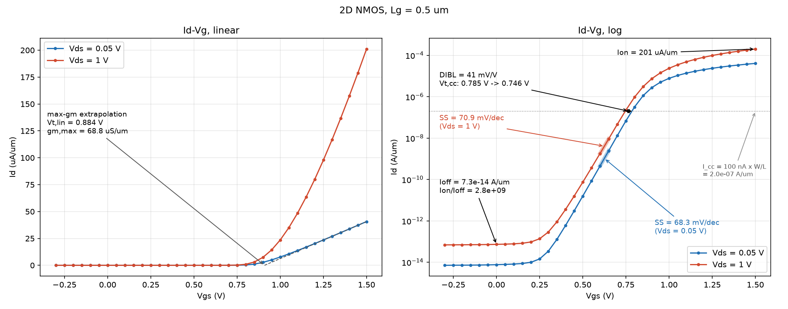
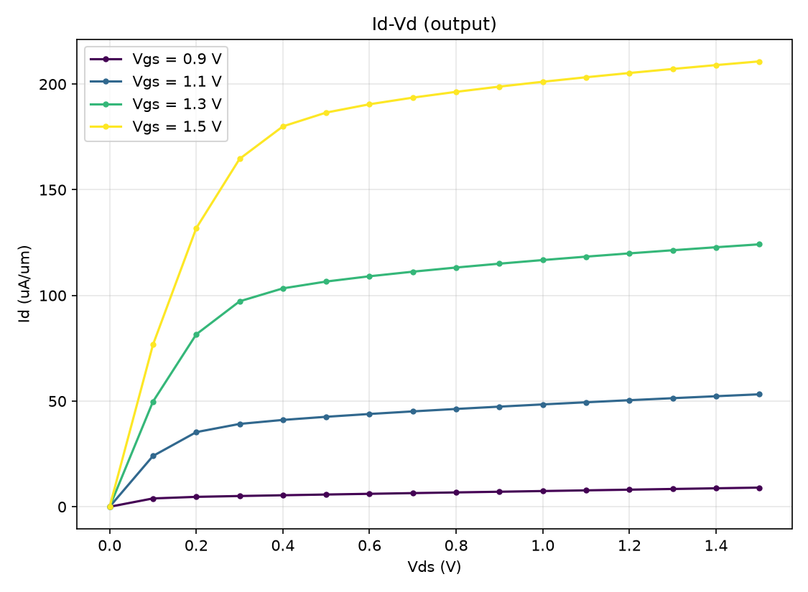
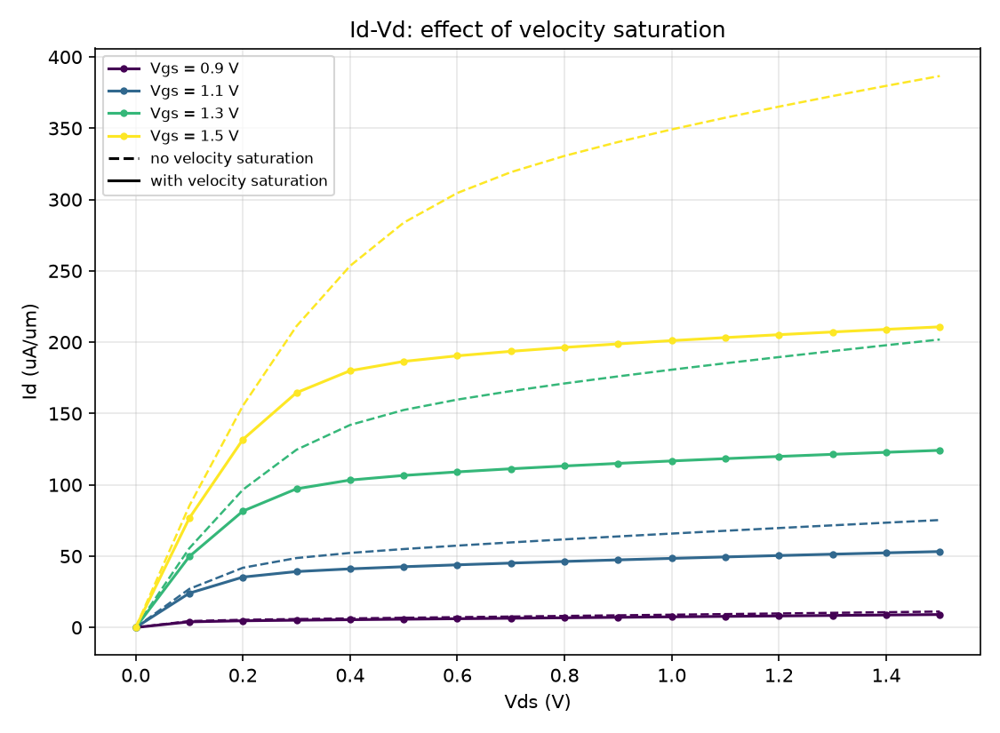
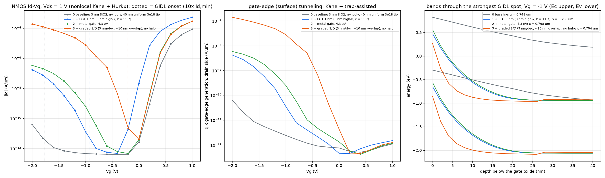
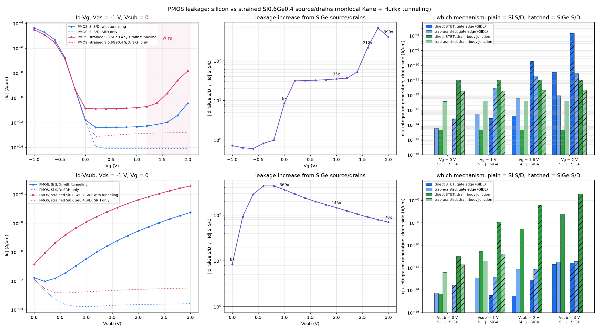

# gatorade_tcaddevice

TCAD-style semiconductor device simulators, built from scratch in
Python/NumPy/SciPy - started in 1D (formerly `tcad1d` / `1D-TCAD`), now 2D,
with 3D planned:

- **1D:** p-n junction diode (drift-diffusion, I-V, avalanche, TAT/BTBT
  leakage) and MOS capacitor (C-V).
- **2D:** diode, MOS capacitor and a planar NMOS transistor on a balanced
  square-quadtree mesh (non-obtuse by construction, refinement boxes,
  graded interface/junction refinement), solved with a coupled Newton
  box-method drift-diffusion solver (quasi-Fermi unknowns,
  Scharfetter-Gummel flux, velocity saturation).

<p align="center">
  
  
</p>

## 2D NMOS (`main2d_mosfet_sweep.py`, `configs/input_mosfet_2d.yaml`)

```bash
python3 main2d_mosfet_sweep.py      # Id-Vg at Vds=0.05/1 V + Id-Vd family, ~20 s
```

Runs every curve as an independent continuation in its own process and
extracts SS, Vt (constant-current and max-gm), DIBL and Ion/Ioff
(`solver2d/mosfet_metrics.py`). Mesh refinement boxes, interface/junction
spacing and `physics: velocity_saturation` are set in the YAML.

<p align="center">
  
</p>
<p align="center">
  
  
</p>

## 2D tunneling leakage: GIDL and junction BTBT (`btbt/`)

Band-to-band (Kane) and trap-assisted (Hurkx) tunneling in the 2D MOSFET,
both as the 1D local-field models and as a **nonlocal** model that traces
tunneling paths along electric field lines (a path exists only where the
bands actually bend by Eg; electrons and holes are generated at opposite
ends). Works across Si/SiGe heterojunctions (band-edge path conditions).

```bash
python3 -m btbt.main_btbt_1d --Na 1e18                         # 1D validation, local vs nonlocal
python3 -m btbt.main_btbt2d_sweep                               # NMOS Id-Vg (GIDL) + Id-Vsub (junction), 4 models
python3 -m btbt.main_btbt2d_sweep configs/input_pmos_2d_btbt.yaml --models none,nonlocal
python3 -m btbt.main_btbt2d_sweep configs/input_pmos_2d_btbt_sige.yaml --models none,nonlocal
python3 -m btbt.compare_pmos_sige                               # PMOS Si vs strained SiGe S/D
python3 -m btbt.gidl_ablation                                   # GIDL onset: EOT, metal gate, graded S/D
```

Outputs go to `out/btbt/`, including field-line / band-diagram figures
(`gidl_fields_bands.png`, `junction_fields_bands.png`) that show where and
why tunneling happens.

<p align="center">
  
</p>
<p align="center">
  
</p>

## Setup

Requires Python 3.9+ (any plain CPython install - no conda needed). Your
system `python3` almost certainly does NOT already have numpy/scipy/
matplotlib/pyyaml installed globally, so create a virtual environment first
rather than trying to run the scripts directly against system Python:

```bash
python3 -m venv .venv
source .venv/bin/activate        # Windows: .venv\Scripts\activate
pip install -r requirements.txt
python3 main.py                  # or any other script below
```

That's the only setup step - every script in this repo (`main.py`,
`mos/mos_main.py`, `avalanche/main_avalanche.py`, `mos/mos_poly_sweep.py`,
`avalanche/avalanche_diagnostics.py`, `testsuite/test_examples.py`, ...) is
then runnable from the repo root, either directly with `python3
<path>/<script>.py` or (for anything inside the `core`/`mos`/`avalanche`
packages) as a module with `python3 -m <package>.<script>`, e.g. `python3
-m mos.mos_main`, no additional configuration, environment variables, or
install steps. All output (plots, CSVs, structure JSON) is written to
`out/<example>/` (e.g. `out/diode/`, `out/mos/`), which already exists in
the repo with the committed reference outputs - reruns just overwrite the
files for whichever example you ran.

To confirm everything works end to end after installing:

```bash
python3 testsuite/test_examples.py   # should print "OK" - 5 tests, no failures
```

## Diode (`main.py`, `configs/input_diode.yaml`)

- Builds a nonuniform 1D mesh across a step p-n junction (sub-nm spacing at
  the junction, geometrically coarsening into the bulk).
- Solves the **equilibrium** nonlinear Poisson equation (Newton's method) for
  the self-consistent built-in potential and space-charge profile.
- Solves the **biased** drift-diffusion system (Poisson + electron/hole
  continuity, Scharfetter-Gummel discretization), sweeping applied voltage
  forward and reverse, using either of two interchangeable solvers:
  - **Gummel iteration**: decoupled, robust, linear convergence (many outer
    iterations).
  - **Coupled Newton**: all three equations (Poisson + both continuity
    equations) solved together with an analytic sparse Jacobian and a direct
    sparse solve per step, quadratic convergence (few outer iterations,
    ~4-10x faster wall-clock depending on bias range - see
    `out/diode/06_solver_benchmark.png`).
- Compares against closed-form theory: built-in potential
  `Vbi = Vt*ln(Na*Nd/ni^2)`, the depletion approximation, and the Shockley
  long-base ideal diode law `I = I0*(exp(V/Vt)-1)`.
- Plots the electron/hole quasi-Fermi potentials (phin, phip) at a
  configurable set of bias points (`input_diode.yaml`: `output.save_bias_points`),
  alongside a full-field CSV export for those points.

All simulation parameters (doping, device thickness, mesh knobs, voltage
sweep range, which solver to use, which bias points to save full fields
for) are read from `input_diode.yaml`, not hardcoded - edit that file to
change them. `params.py` just holds the defaults it overrides. Doping on
either side can be `flat` (uniform), `linear` (graded), or `gaussian`
(implant-like) - see the comments in `input_diode.yaml` for the schema; the
mesh (`mesh.py`) automatically refines wherever a graded profile changes
quickly, not just at the junction.

```bash
python3 main.py
```

### Diode results

- The numerically self-consistent built-in potential matches
  `Vt*ln(Na*Nd/ni^2)` to 8 significant figures.
- The equilibrium potential profile matches the depletion approximation,
  with the expected smoothing (over a Debye length) at the depletion edges
  that the depletion approximation idealizes as abrupt.
- The extracted ideality factor rises toward n≈1.85 near the recombination
  peak (SRH recombination in the depletion region dominates at low forward
  bias) and relaxes toward n≈1 at higher forward bias (bulk diffusion
  current dominates) — the textbook two-regime diode I-V curve:

  
- Reverse leakage current is orders of magnitude above the ideal Shockley
  I0, correctly reflecting depletion-region generation current that the
  simple long-base ideal-diode formula does not model.
- Beyond the numeric-vs-analytic comparisons above, every run also writes a
  `*_structure.json` (device geometry, mesh, doping, per-bias fields - see
  `structure_io.py`; the filename is set by `input_diode.yaml`'s
  `output.structure_file`, or `null` to skip writing it) that `plot.py`
  turns into textbook-style diagrams: the device cross-section with mesh
  node density visible, a real Ec/Ev/Ei/Ef band diagram (not just
  electrostatic potential), and a fixed/mobile/net charge-density
  decomposition - either automatically as part of `main.py`/`mos_main.py`,
  or standalone later against just the JSON file, with individual
  curves toggleable:
  ```bash
  python3 core/plot.py out/diode/diode_structure.json                     # all three plots, all curves
  python3 core/plot.py out/diode/diode_structure.json --which bands --band-fields Ec,Ev,Ef
  python3 core/plot.py out/diode/diode_structure.json --interactive          # one window, all fields loaded, click to toggle
  ```

  
- The coupled Newton solver matches Gummel's current to 4+ significant
  figures at every bias point while using far fewer outer iterations
  (quadratic vs. linear convergence); the speedup grows with how hard the
  bias point is to converge (~4x over a mild 0.65V forward sweep, ~10x once
  the sweep is pushed to 1.2V/high injection, where Gummel starts hitting
  its iteration cap without fully converging - see `DEVELOPMENT_LOG.md`).

All simulation parameters for both tools are read from their `input_*.yaml`
file, not hardcoded - `params.py`/`mos_params.py` just hold the defaults
those files override. The two YAML files use a deliberately parallel
schema (`doping`, `mesh`, `voltage_sweep`, `output` sections) even though
the tools don't yet share a single "device stack" description - see
`mesh.py`'s module docstring for what they do share (the mesh engine
itself and the doping-profile machinery in `doping_profiles.py`).

## MOS capacitor (`mos/mos_main.py`, `configs/input_mos.yaml`)

- Builds a mesh across a metal gate - thin oxide - uniform substrate stack
  (either p- or n-type; generic to pMOS-cap or nMOS-cap).
- A MOS capacitor has **no current path** in steady state (the gate is an
  ideal insulator), so at every DC gate voltage the structure sits at a
  single, uniform Fermi level - the **low-frequency (quasi-static) C-V
  curve** needs only a sequence of equilibrium nonlinear-Poisson solves
  (reusing the diode's `solve_poisson`, generalized to a position-dependent
  permittivity and intrinsic concentration for the oxide/semiconductor
  stack), no continuity equations or AC analysis at all:
  `C(V_G) = -dQ_gate/dV_G` from numerically differentiating the swept
  charge.
- The **high-frequency C-V curve** (inversion/minority charge can't follow
  a fast probe signal) is a **quasi-small-signal** calculation, not a
  literal frequency-domain solve: freeze the minority carrier
  (`solve_poisson`'s `n_frozen` for a p-substrate, `p_frozen` for an
  n-substrate) at its low-frequency value, perturb V_G by a small amount,
  and let only the majority carrier and potential respond.
- Compares against closed-form depletion-approximation theory: flat-band
  voltage (computed from an explicit, physically real gate work function -
  `input_mos.yaml`: `gate.workfunction_eV`, or `null` for the ideal
  phi_ms=0 assumption), threshold voltage, and analytic low-/high-frequency
  C-V curves.
- Oxide thickness, oxide permittivity, substrate doping (`flat`/`linear`/
  `gaussian` - e.g. a shallow threshold-adjust implant right under the
  gate), and every mesh knob are all read from `input_mos.yaml`, not
  hardcoded.

```bash
python3 -m mos.mos_main
```

### MOS-cap results

- The numeric C-V curve reproduces the textbook shape exactly: accumulation
  (C→C_ox), depletion (matches the analytic depletion approximation
  closely), and the classic **low-frequency/high-frequency split** in
  inversion (low-freq rises back toward C_ox as the inversion layer forms
  and can respond; high-freq stays pinned near C_min since it can't):

  
- In accumulation, the numeric result converges (confirmed via a mesh
  refinement study) to ~0.84 x C_ox rather than the idealized analytic
  C_ox - a real, finite accumulation-layer screening-length effect the
  simple depletion approximation doesn't capture, requiring a much finer
  near-interface mesh than the depletion region needs to resolve properly.
- Verified generic to both substrate types: for the same 1e16 cm^-3
  doping, threshold voltage comes out at +0.728V for a p-substrate and the
  mirror-image -0.728V for an n-substrate, with the accumulation/depletion/
  inversion regions correctly swapping which side of V_FB they fall on.
- Also gets the `plot.py` structure/band/charge diagrams described above
  (see the diode section) - the MOS-cap band diagram shows the ~3.15 eV
  Si/SiO2 conduction-band offset (from each material's own electron
  affinity, via `mos_params.py`'s approximate SiO2 constants) come out
  correctly, and the charge-density plot is labeled with the
  accumulation/depletion/inversion regime at each saved gate voltage.

  

## Files

| File | Purpose |
|---|---|
| `configs/input_diode.yaml` | **Edit this** for the diode: doping (flat/linear/gaussian per side), thickness, mesh knobs, voltage sweep, solver (`math_model: gummel` \| `newton`), which bias points to save fields for |
| `core/config.py` | Loads `configs/input_diode.yaml` into `Material`/`Device`/voltage-sweep/solver-choice/mesh overrides |
| `configs/input_mos.yaml` | **Edit this** for the MOS capacitor: substrate polarity/doping (flat/linear/gaussian), oxide thickness/permittivity, gate work function, mesh knobs, voltage sweep |
| `mos/mos_config.py` | Loads `configs/input_mos.yaml` into `Material`/`MOSDevice`/voltage-sweep/mesh overrides |
| `core/doping_profiles.py` | Shared doping-profile shapes (flat/linear/gaussian) and their sampling/reference-concentration logic, used by both YAML files and both mesh builders |
| `core/params.py` | Physical constants and diode material/device parameter defaults |
| `mos/mos_params.py` | MOS capacitor device parameters (oxide thickness, gate work function, SiO2 permittivity) |
| `core/mesh.py` | Shared mesh engine (`build_diode_grid`, `build_mos_grid`): geometric refinement at hard interfaces plus adaptive refinement wherever a graded doping profile changes quickly |
| `core/physics.py` | Bernoulli function (+ its derivative), nonlinear Poisson (Newton, generalized to array eps/ni and frozen-carrier modes), Scharfetter-Gummel continuity solves |
| `core/analytic.py` | Diode closed-form comparisons (Vbi, depletion width, Shockley law) |
| `mos/mos_analytic.py` | MOS-cap closed-form comparisons (flat-band/threshold voltage, analytic low-/high-freq C-V) |
| `core/solver.py` | Diode equilibrium solve + bias sweep (dispatches to either solver below) |
| `core/newton_solver.py` | Diode's fully coupled Newton solve: analytic sparse Jacobian, direct sparse solve, backtracking line search |
| `mos/mos_solver.py` | MOS-cap equilibrium C-V sweep (low-frequency) and frozen-carrier quasi-small-signal sweep (high-frequency) |
| `core/field_save.py` | Shared helper: selecting which bias points to save full field profiles for, quasi-Fermi-potential plotting, field CSV export |
| `core/structure_io.py` | Schema + save/load for the `*_structure.json` files each driver writes: device geometry, mesh, doping, and per-bias fields, in one human-readable file `plot.py` (or a future 2D/3D version of this project) can read back |
| `core/plot.py` | Structure/band-diagram/charge-density plot library, driven from a loaded structure file. Also runnable standalone against just a `*_structure.json`: `python3 core/plot.py out/diode/diode_structure.json --interactive` opens one window with every plot and field already loaded, click a checkbox to toggle a curve; `--which`/`--band-fields`/`--charge-fields` narrow down what gets drawn (in either interactive or plain PNG mode) |
| `main.py` | Diode driver: runs the sweep with both solvers (for the benchmark) plus the one from `configs/input_diode.yaml`, generates plots and CSVs in `out/diode/` |
| `mos/mos_main.py` | MOS-cap driver: runs the C-V sweep, generates plots and CSVs in `out/mos/` (or `out/mos_poly/` for a poly-gate input) |

Requires `numpy`, `scipy`, `matplotlib`, `pyyaml`. Output plots and CSVs are
written to `out/<example>/` (a separate subfolder per example; filenames don't collide).
